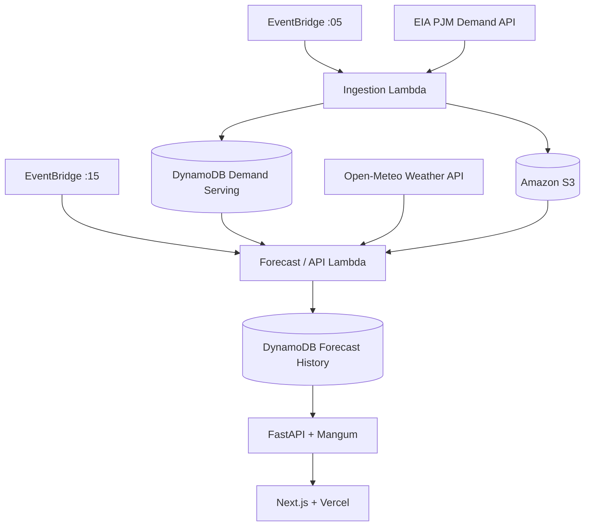

# GridOps

**GridOps** is an end-to-end, serverless electricity-demand forecasting platform for the **PJM Interconnection**. It automatically ingests fresh grid-demand data, combines it with regional weather and calendar features, generates 24-hour and 48-hour demand forecasts, stores the results, and serves them through a public web application.

**Live Demo:** https://gridops-olive.vercel.app

---

## Overview

GridOps was built to go beyond a typical machine-learning notebook. The goal was to create a complete production-style ML system that handles the full lifecycle:

```text
Data ingestion
    ↓
Validation and archival
    ↓
Feature engineering
    ↓
Model training and evaluation
    ↓
Model tracking and promotion
    ↓
Serverless inference
    ↓
Scheduled forecast generation
    ↓
Public API
    ↓
Web application
```

The system is split into two environments:

- **Offline / model-development path** for historical analysis, feature engineering, training, evaluation, and model management.
- **Online / production path** for lightweight, low-cost, automated ingestion and inference.

---

## What GridOps Does

GridOps generates two point forecasts for total PJM electricity demand:

- **24-hour forecast** — predicts demand approximately 24 hours ahead.
- **48-hour forecast** — predicts demand approximately 48 hours ahead.

Each model predicts a single target hour rather than a full hourly trajectory.

The public application displays the latest forecasts, target timestamps, latest available PJM source-data timestamp, and system status.

---

## Architecture



### Production flow

1. EventBridge triggers the ingestion Lambda hourly.
2. The ingestion Lambda requests the newest PJM demand observations from the EIA API.
3. Raw responses are archived in Amazon S3.
4. Valid observations are written to DynamoDB for low-latency serving.
5. A second EventBridge schedule triggers forecast generation.
6. The forecast Lambda reads recent demand, retrieves weather forecasts from Open-Meteo, and builds demand, weather, and calendar features.
7. Production XGBoost models are loaded from S3 and used to generate 24-hour and 48-hour forecasts.
8. Forecasts are persisted in a second DynamoDB table.
9. FastAPI exposes the latest stored forecasts.
10. The Next.js frontend deployed on Vercel displays them publicly.

The deployed production system does not depend on the developer machine being online.

---

## Data Sources

### PJM electricity demand

GridOps retrieves hourly PJM regional demand data from the **U.S. Energy Information Administration (EIA)** electricity RTO API.

The system preserves raw source truth. Missing timestamps and source-null values are not silently imputed in the raw layer. Validation identifies anomalies, while unusable null observations are excluded from the online serving table.

### Weather

Weather forecasts are retrieved from **Open-Meteo** for six representative PJM-area locations:

- Philadelphia
- Pittsburgh
- Washington, D.C.
- Columbus
- Baltimore
- Richmond

Regional weather features include temperature, humidity, dew point, apparent temperature, precipitation, wind, and derived heating/cooling indicators.

---

## Feature Engineering

GridOps combines demand, weather, and calendar features.

### Demand features

```text
24-hour model:
- demand_lag_26h
- demand_lag_48h
- demand_lag_168h
- demand_lag_336h

48-hour model:
- demand_lag_50h
- demand_lag_72h
- demand_lag_168h
- demand_lag_336h
```

Rolling demand statistics are also included.

An explicit hourly time spine is used so missing source timestamps cannot silently shift lag definitions.

### Leakage prevention

GridOps intentionally keeps a two-hour source-data safety buffer during model feature construction.

```text
24h: target - 26h = issue time - 2h
48h: target - 50h = issue time - 2h
```

This prevents the models from using demand observations that may not realistically have been available when the forecast was issued.

### Calendar features

Calendar features are generated in U.S. Eastern Time and include hour of day, day of week, month, weekend indicator, U.S. holiday indicator, and day-before/day-after-holiday indicators.

---

## Machine Learning

GridOps uses separate **XGBoost regression models** for the 24-hour and 48-hour horizons.

XGBoost was selected because the problem is dominated by structured tabular features such as recent demand, rolling statistics, weather forecasts, time-of-day effects, and holidays.

The final champion models use approximately:

```text
n_estimators:       700
learning_rate:      0.05
max_depth:          4
min_child_weight:   5
subsample:          0.9
colsample_bytree:   0.9
reg_lambda:         1
reg_alpha:          0
```

---

## Model Performance

Final performance was evaluated on a frozen test set.

| Horizon | XGBoost WAPE | Baseline WAPE | Improvement |
|---|---:|---:|---:|
| 24 hours | **3.412%** | 6.373% | **46.466%** |
| 48 hours | **3.672%** | 8.178% | **55.096%** |

**WAPE (Weighted Absolute Percentage Error)** is:

```text
sum(|actual - forecast|) / sum(actual)
```

Lower is better.

---

## Model Lifecycle and MLflow

GridOps uses **MLflow** for experiment tracking and model lifecycle management.

Registered production models:

```text
gridops-demand-24h
gridops-demand-48h
```

The workflow is:

```text
Train model
    ↓
Track experiment in MLflow
    ↓
Select champion model
    ↓
Publish champion artifact to S3
    ↓
Verify artifact checksum
    ↓
Load production artifact in Lambda
```

MLflow is intentionally not required in the production serving path. Production Lambda functions load versioned champion artifacts directly from S3.

---

## Offline vs. Online Architecture

### Offline / development

```text
S3
 ↓
PostgreSQL
 ↓
dbt
 ↓
Feature marts
 ↓
XGBoost training
 ↓
MLflow
```

### Online / production

```text
DynamoDB
 ↓
Feature generation
 ↓
XGBoost
 ↓
Lambda
 ↓
Forecast history
```

Before switching production inference from PostgreSQL to DynamoDB, GridOps verified demand-history parity, feature parity, and prediction parity.

---

## Serverless AWS Deployment

GridOps uses a serverless architecture to minimize idle infrastructure cost.

### AWS services

- **Lambda** — runs ingestion, forecast generation, and API logic.
- **EventBridge** — schedules hourly ingestion and forecast jobs.
- **DynamoDB** — stores recent serving demand and forecast history.
- **S3** — archives raw data and stores production model artifacts.
- **ECR** — stores Lambda container images.
- **CloudWatch** — stores logs and runtime diagnostics.
- **IAM** — provides scoped execution permissions.

The application is packaged as Docker container images, pushed to ECR, and executed by Lambda in AWS-managed environments.

---

## API

The backend is built with **FastAPI** and adapted for Lambda using **Mangum**.

### Latest stored forecasts

```http
GET /forecasts/latest/24
GET /forecasts/latest/48
```

### Live forecast endpoints

```http
POST /forecast/24h
POST /forecast/48h
```

### Lower-level prediction endpoints

```http
POST /predict/24h
POST /predict/48h
```

---

## Frontend

The public interface is built with:

- Next.js
- React
- TypeScript
- Tailwind CSS
- Vercel

**Live site:** https://gridops-olive.vercel.app

---

## Technology Stack

### Languages
Python, TypeScript, SQL

### Data and ML
Pandas, NumPy, XGBoost, scikit-learn, MLflow, dbt, PostgreSQL, DynamoDB

### Data Engineering
Prefect, EIA API, Open-Meteo API, Amazon S3

### Backend and Deployment
FastAPI, Mangum, Docker, AWS Lambda, ECR, EventBridge, CloudWatch, IAM

### Frontend
Next.js, React, TypeScript, Tailwind CSS, Vercel

---

## Repository Structure

```text
GridOps/
├── src/gridops/
│   ├── api/
│   ├── ingestion/
│   ├── inference/
│   ├── modeling/
│   ├── storage/
│   ├── quality/
│   ├── database/
│   ├── flows/
│   └── tasks/
├── scripts/
├── tests/
├── frontend/
├── Dockerfile.lambda
├── Dockerfile.ingestion.lambda
├── requirements-lambda.txt
├── requirements-ingestion-lambda.txt
└── pyproject.toml
```

---

## Key Engineering Decisions

- **Separated training from serving:** PostgreSQL, dbt, Prefect, and MLflow support offline development; DynamoDB, S3, and Lambda support production.
- **Preserved raw source truth:** raw EIA anomalies are archived rather than silently corrected.
- **Separated source freshness from model safety:** ingestion collects everything available while inference independently enforces a two-hour information buffer.
- **Used idempotent, overlapping ingestion:** retries and delayed source observations can be handled safely.
- **Precomputed forecasts:** website visitors read saved forecasts instead of triggering repeated ML inference.
- **Used lazy model loading:** simple stored-forecast reads do not load XGBoost models unnecessarily.
- **Kept production serverless:** avoids always-on VM/database infrastructure for a low-volume workload.

---

## Local Development

Typical local requirements:

- Python 3.12
- Docker
- PostgreSQL
- AWS credentials
- EIA API key
- Node.js / npm

Example environment variables:

```bash
EIA_API_KEY=...
AWS_REGION=us-east-1
S3_RAW_BUCKET=...
DYNAMODB_DEMAND_TABLE=gridops-demand-serving
FORECAST_HISTORY_TABLE=gridops-forecast-history
```

Secrets must not be committed to Git.

### Python

```bash
python -m venv .venv
pip install -e .
pytest
```

### API

```bash
uvicorn gridops.api.main:app --reload
```

### Frontend

```bash
cd frontend
npm install
npm run dev
```

---

## Production Scheduling

```text
:05  → check for and ingest new EIA demand data
:15  → generate new 24h and 48h forecasts
```

The schedules are separated so ingestion can complete before forecast generation begins.

---

## Current Limitations

- Each model predicts one target hour rather than a full future load curve.
- Weather is represented using six regional locations rather than a dense spatial model.
- Forecast quality depends on upstream EIA and weather-data availability.
- Realized production-error monitoring is not yet fully automated.
- The frontend focuses on the latest forecasts rather than historical visualization.

---

## Future Improvements

- realized forecast-error tracking,
- rolling production WAPE,
- model-drift monitoring,
- automated retraining policies,
- full 24/48-hour forecast trajectories,
- historical forecast visualization,
- Terraform infrastructure-as-code,
- GitHub Actions CI/CD,
- expanded observability and alerting.

---

## Why This Project Exists

GridOps was designed to answer a question that many ML projects stop short of:

> **What happens after the model is trained?**

The project demonstrates the full path from raw external data to a continuously operating public ML product:

```text
ingest
→ validate
→ transform
→ train
→ evaluate
→ version
→ deploy
→ schedule
→ serve
→ monitor
```

The goal is not only to produce an accurate forecast, but to build the engineering system required to make that forecast reproducible, automated, deployable, and useful.

---

## Author

**Yashwanth Kadari**  
Virginia Tech — Computational Modeling and Data Analytics

- LinkedIn: https://www.linkedin.com/in/yashwanthKadari
- GitHub: https://github.com/YKadari
- GridOps: https://gridops-olive.vercel.app
